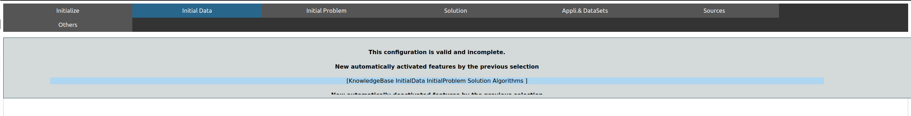
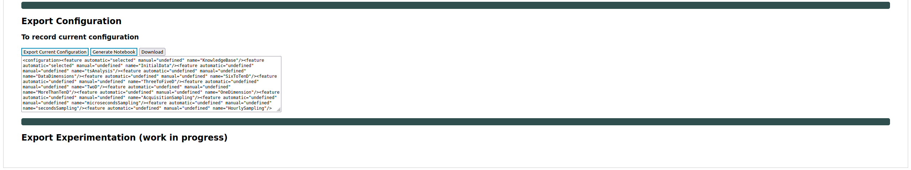

# About

This file is a tutorial. The goal is for you to understand how to use the configurator and at the same to assert that the software works as intended.

This protocol is only about reproducing the feature selection process.

Other files are here to help you reproduce the problem configuration as a whole.

**Disclaimer** : We assume from here that you are running the project with Docker as explained in the README file.

## Protocol

### Run the projet

1. Exec start script -> `./start.sh`

2. Go on this link -> [here](http://localhost:5050/)

You will see this web page:

### Generation protocol

3. In the section _Feature Model Selection_, click on _browse_ button.

4. Go through your files, to the project directory. Once you're in, go into _Static_, _featureModel_, and select _fm.xml_.

path: `_path_to_project_dir_/splc-artifact-main/static/featureModel/fm.xml`

Once it is done, you should see something like this:

5. Now, click on the button _generate the configurator_.

You are now in the process of configuration.

You should now see this on your screen :

**Do not worry** about the message saying "this configuration is valid and complete".
The configuration is indeed valid, this means the loading and creation of the whole constraint system is successful.
This area is present across all tabs because it keeps track of all automatically selected or deselected features due to constraint propagation.

As we just want to replicate the feature selection process here, you can click on the _solution_ tab. Other tabs are responsible for `Initial Data` configuration, `Business requirements` configuration and `Past experiments` configuration.

6.Now that we are in the _solution_ tab, in order to reproduce the experiment notebook, you have to select:

_The algorithm checkbox is already selected, it is a default preset._

- `RandomForest` which is under `DecisionTree` in `ML_Algorithm`

- `RobustScaler` which is under `DataNormalization` in `DataPreparation`

- `Fscore` which is under `ML_Metrics` in `Evaluation`

7. Once it is done, go back at the top of the page and click on the _initialize_ tab.

8. Go down in the page to find the _Export configuration_ section, and then click on _export current configuration_ button. You should see text appear in the text area. It is your complete configuration as xml text.

You should see this on your screen:

9. Then click on the _Generate notebook_ button. If it worked correctly you should see a popup window saying that the notebook has been generated.

10. Finally, click on the _download_ button, and the notebook should be downloaded. Depending on your browser settings, you might be asked where you want to save the file. Save it where it will be easy for you to find it.

### Comparison

The goal is now for you to compare the notebook you just generated with the base model from the projet. **They should be exactly the same** apart from one markdown cell in the base model to assess that this is the one to replicate.

In order to compare the notebook you just generated and the one that was the base model:

11. Firstly, open the one in your downloads with an ide, It should contains cells, from both type, code and markdown.

12. Go back to the projet directory and open the base model that is at the following path (once again with an ide)

path: `_path_to_project_dir_/splc-artifact-main/static/Notebooks/experiment_notebook.ipynb`
