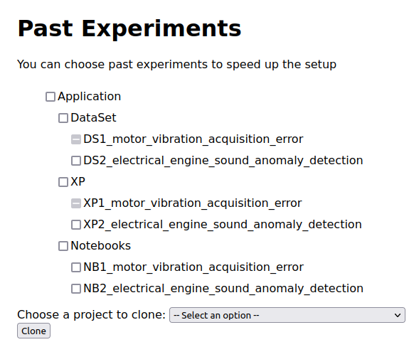
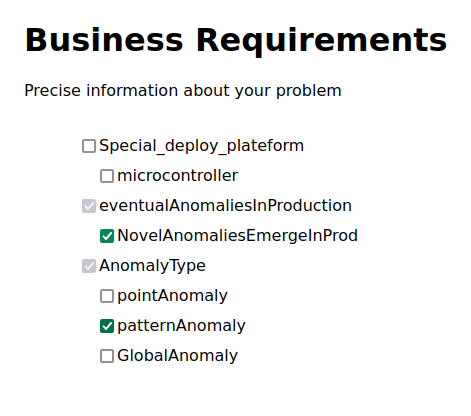
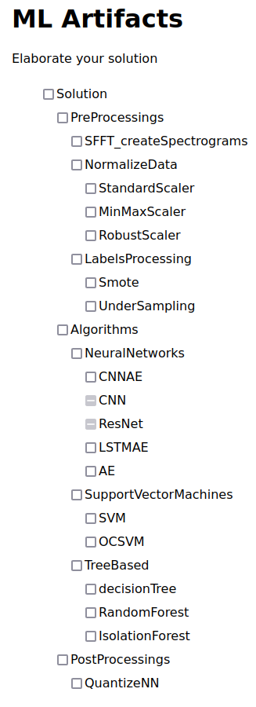
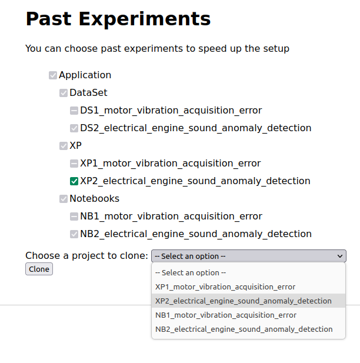

# Overview of Scenario 1: Retrieve and clone notebook

The goal is for you to reproduce the scenario 1 depicted in the _section 5.2_ of the paper.
With this scenario, we want to evaluate how our approach differentiates itself from a keyword-based search.

Detailed steps are given to you in order to replicate each step of the scenario.

**Disclaimer**:

We assume from here that you are running the project with Docker as explained in the [README file](https://github.com/Yann-Brault/splc-artifact/blob/main/README.md).

**Checkboxes rules**:

- One click to check 

- two clicks to disable 

- Three clicks (total) to reset a checkbox

If a checkbox is grey (see image), it has been automatically checked or disabled by the system due to constraint propagation.

- auto check 

- auto disable 

## Data

Data to reproduce the experience will be given when cloning the experience.

## Protocol

### Run the projet

1. Exec start script -> `./start.sh`

2. Go on this link -> [here](http://localhost:5050/)

You will see this web page:

### Initialize the configurator

**The web page must be reloaded between each scenario**

3. In the section _Feature Model Selection_, click on _browse_ button.

4. Go through your files, to the project directory. Once you're in, go into _static_, _illustration_test_case_, and select _illustrative_fm_scenario1.xml_.

path: `path_to_project_dir/splc-artifact-main/static/illustration_test_case/illustrative_fm_scenario1.xml`

Once it is done, you should see something like this:

5. Now, click on the button _generate the configurator_.

You are now in the configuration process.

You should now see this on your screen :

The area at the top is present across all tabs. It keeps track of all automatically selected or deselected features due to constraint propagation.

### Unfolding the scenario : Retrieve and clone notebook

#### Step 1 of scenario 1 unfolding

6. As you already are in the tab _Initial Data_, you can check, with one click on the checkbox, the **TimeSeries** option and **PartiallyLabelled** option. Then you can disable **NormalizedData** by double clicking on the checkbox.

You should have this result:

> If you click on tab _Past Experiments_ you can confirm that the **XP1** has been automatically disabled. The given specification is sufficient to exclude **XP1**, which dealt with motor vibration but was performed on unlabelled data. However, this finding does not contradict the
> associated notebook, which employs an algorithm capable of
> handling partially labelled data.

#### Step 2 of scenario 1 unfolding

7. You can now click on tab _Business Requirements_ in order to complete them. Thus, you can check the option **NovelAnomaliesEmergeInProd** and **patternAnomaly**.

> If you click on the tab _ML Artifacts_ you can confirm that two ML artifacts have been automatically disabled, **CNN** and **ResNet**, as they are not suitable for handling new anomalies in production.

#### Step 3 of scenario 1 unfolding

8. If you now click on tab _Past Experiments_, you can confirm that **XP1** is still disabled and **XP2** is available for reuse. About notebooks, both **NB1** and **NB2** are available too.

So, you can click on the checkbox of the **XP2** firstly, in order to add it to your configuration. Then you go to the form at the bottom of the page.

Click on the select menu in order to display options, then select the **XP2** option.

#### Step 4 of scenario 1 unfolding

9. Finally you can click on the button _clone_. **Beware that the generation process may take several minutes (2 to 4 minutes on our development machine) as it generates a zip file of 1.6Go corresponding to the complete notebook.**

This should trigger the download of the **XP2** project as a **zip file**. Depending on your browser settings, you might be asked where you want to save the file. Save it where it will be easy for you to find it.

Once you have unzipped the project, you should have a directory with this file strucutre:

XP2_electrical_engine_sound_anomaly_detection/  
&nbsp;&nbsp;&nbsp; XP2_electrical_engine_sound_anomaly_detection/  
&nbsp;&nbsp;&nbsp;&nbsp;&nbsp; dataset/  
&nbsp;&nbsp;&nbsp;&nbsp;&nbsp;&nbsp;&nbsp; IDMT-ISA-ELECTRICAL-ENGINE/  
&nbsp;&nbsp;&nbsp;&nbsp;&nbsp;&nbsp;&nbsp; Spectrograms/  
&nbsp;&nbsp;&nbsp;&nbsp;&nbsp; notebook.ipynb  
&nbsp;&nbsp;&nbsp;&nbsp;&nbsp; XP2_config.xml  
&nbsp;&nbsp;&nbsp; current_config.xml

The subfolder of XP2 contains the configuration, the notebook and dataset of this experience.
Your configuration is the file _current_config.xml_

### End

You can open the notebook in order to check its construction.  
If you want to execute the notebook you will have to install the libraries first.
Then you can execute cells in sequential order starting from the imports cell but skip the **Data formating** section, as Spectrograms data are already computed and included with the dataset.

### Conclusion

So with this scenario, You have been able to retrieve several past experiments and notebooks by giving to the system your configuration. Thanks to the constraints model you were able to clone one that match your problem.
