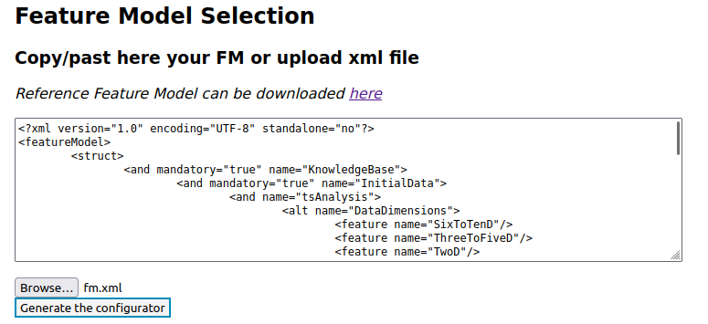
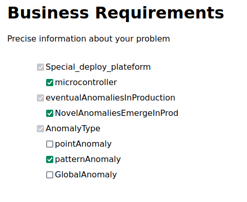

# About

This file is a tutorial. The goal is for you to reproduce the scenario depicted in the _section 5.2_ of the article.

Detailed steps are given to you in order to replicate each step of the scenario.

**Disclaimer** : We assume from here that you are running the project with Docker as explained in the [README file](https://anonymous.4open.science/r/splc-artifact-files/README.md).

Checkboxes rule :

- One click to select / enable 
- two clicks to deselect / disable 
- Three clicks (total) to reset a checkbox

If a checkbox is grey (see image), it has been automatically enabled or disabled by the system due to constraint propagation.

- auto enable 
- auto disable 

## Protocol

### Run the projet

1. Exec start script -> `./start.sh`

2. Go on this link -> [here](http://localhost:5050/)

You will see this web page:

### Initialize the configurator

3. In the section _Feature Model Selection_, click on _browse_ button.

4. Go through your files, to the project directory. Once you're in, go into _static_, _illustration_test_case_, and select _illustrative_feature_model.xml_.

path: `_path_to_project_dir_/splc-artifact-main/static/illustration_test_case/illustrative_feature_model.xml`

Once it is done, you should see something like this:

5. Now, click on the button _generate the configurator_.

You are now in the process of configuration.

You should now see this on your screen :

**Do not worry** about the message saying "this configuration is valid and complete".
The configuration is indeed valid, this means the loading and creation of the whole constraint system is successful.
This area is present across all tabs because it keeps track of all automatically selected or deselected features due to constraint propagation.

### Unfolding the scenario : Decoration

##### Step 1 of scenario 5.2 unfolding

6. SInce you are in the tab _Initial Data_, you can select, with one click on the checkbox, the **TimeSeries** option and **PartiallyLabelled** option. Then you can disable **NormalizedData** by double clicking on the checkbox.

You should have this result:

7. If you click on tab _Appli & Dataset_ you can confirm that the **XP1** has been automatically disabled, but the **NB1** is still enable.

(image here, coming after FM update)

##### Step 2 of scenario 5.2 unfolding

8. You can now click on tab _Initial Problem_ in order to complete business requirements. Then, you can select the option **NovelAnomaliesEmergeInProd**, **PatternAnomaly** and **Microcontroller** as it will be deployed on this type of system.

9. If you click on tab _Solutions_ you can confirm that two ML components have been automatically disabled, **CNN** and **Resnet**, as specified in the step 2.

10. If you now click on tab _Appli & Dataset_, you can confirm that **XP1** is still disabled and **XP2** and **XP3** are now disabled too.

(image here, coming after FM update)

About notebooks, all are still available.

(image here, coming after FM update)

#### Step 3 of scenario 5.2 unfolding

11. You can now go back to the tab _Solutions_, go to the bottom of the page and enable _QuantizeNN_ by clicking on the checkbox once. Due to constraints linked to selection of _QuantizeNN_, you should have such a configuration:

#### Step 4 of scenario 5.2 unfolding

12. At this stage, if you go back to the _Appli & Dataset_ tab, you can confirm that all XPs are disabled and that the **NB1** too.

(image here, coming after FM update)

#### Step 5 of scenario 5.2 unfolding

13. Go bakc to the tab _Appli & Dataset_. As mentionend in step 10 you have **NB2** or **NB3** available. **NB3** being a clone of **NB2** (cf reproduce scenario 1) you select either one of them.

14. Since this scenario is about decorating an existing notebook in order to tailor it, you have to check the checkbox of your choice, **NB2** or **NB3**.

#### Step 6 of scenario 5.2 unfolding

15. Once it is done, go back at the top of the page and click on the _initialize_ tab.

16. Go down in the page to find the _Export configuration_ section, and then click on _export current configuration_ button. You should see text appear in the text area. It is your complete configuration as xml text.

You should see this on your screen:

17. Then click on the _Generate notebook_ button. If it worked correctly you should see a popup window saying that the notebook has been generated.

18. Finally, click on the _download_ button, and the notebook should be downloaded. Depending on your browser settings, you might be asked where you want to save the file. Save it where it will be easy for you to find it.

### Extra steps

You might want to download the notebook before the decoration. In order to this:

19. Go back to the top of the page and click on the _Appli & dataset_ tab. Go to the bottom to the clone form. Click on the select menu in order to display options, then select the notebook option that match the one you decorated.

Finally you can click on the button _clone_.
This should trigger the download of the notebook as a **zip file**. Depending on your browser settings, you might be asked where you want to save the file. Save it where it will be easy for you to find it.

You can compare both notebooks to assert that they are similar except for the new ML component, the **QuantizeNN**.
