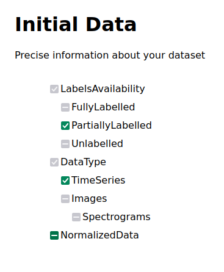
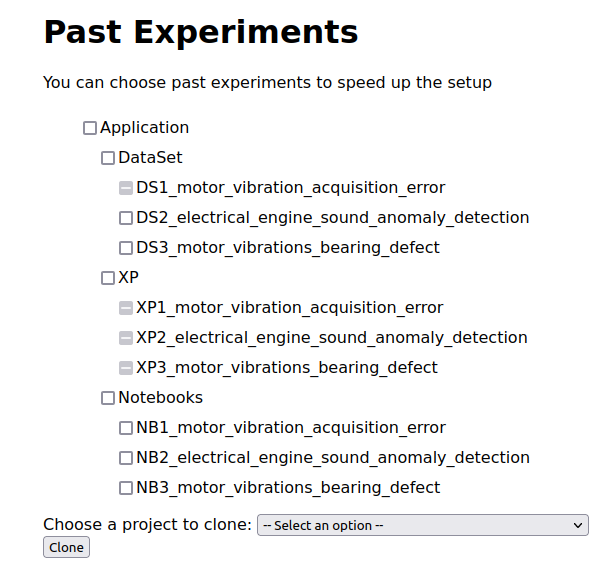
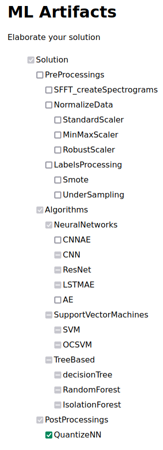
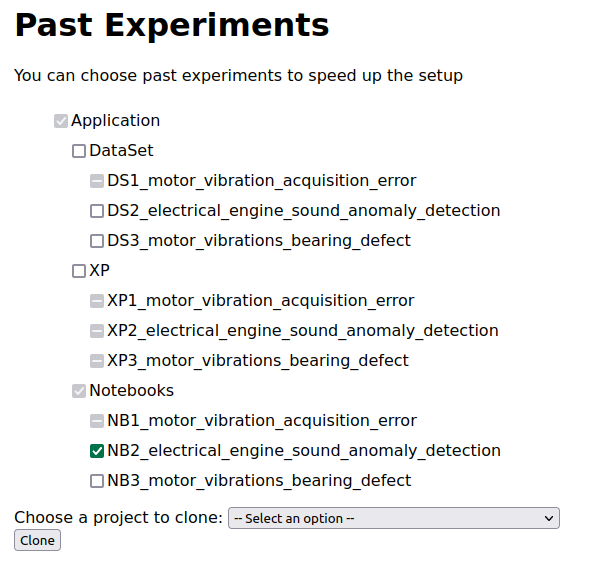
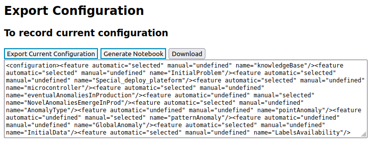
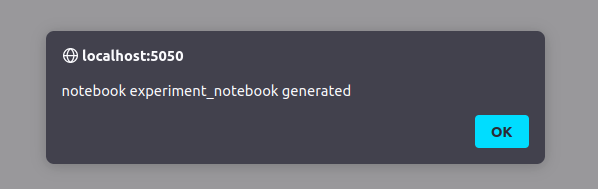
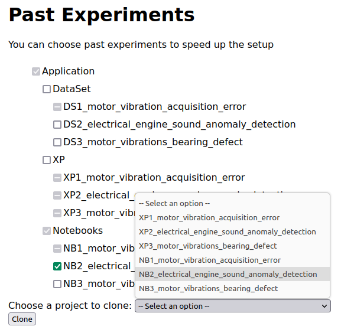

# About

The goal is for you to reproduce the scenario depicted in the _section 5.3_ of the article.
With this scenario, we aim to evaluate how our approach, through its configuration and generation capabilities, helps the user to compose a solution that experiments only partially cover.
Detailed steps are given to you in order to replicate each step of the scenario.

**Disclaimer** : We assume from here that you are running the project with Docker as explained in the [README file](https://anonymous.4open.science/r/splc-artifact-files/README.md).

Checkboxes rule :

- One click to check 

- two clicks to disable 

- Three clicks (total) to reset a checkbox

If a checkbox is gray (see image), it has been automatically checked or disabled by the system due to constraint propagation.

- auto check 

- auto disable 

Dataset used in notebooks are **not** given into project zip. This is due to a very limited storage space on the anonymization system. Therefore notebooks **cannot** be executed.

## Protocol

### Run the projet

1. Exec start script -> `./start.sh`

2. Go on this link -> [here](http://localhost:5050/)

You will see this web page:

### Initialize the configurator

3. In the section _Feature Model Selection_, click on _browse_ button.

4. Go through your files, to the project directory. Once you're in, go into _static_, _illustration_test_case_, and select _illustrative_fm_scenario2.xml_.

path: `_path_to_project_dir_/splc-artifact-main/static/illustration_test_case/_illustrative_fm_scenario2.xml`

Once it is done, you should see something like this:

5. Now, click on the button _generate the configurator_.

You are now in the configuration process.

You should now see this on your screen :

**To change**

**Do not worry** about the message saying "this configuration is valid and complete".

The configuration is indeed valid, this means the loading and creation of the whole constraint system is successful.

This area is present across all tabs because it keeps track of all automatically selected or deselected features due to constraint propagation.

### Unfolding the scenario: Reuse, complete and generate notebook

#### Step 1 of scenario 5.2 unfolding

6. Since you already are in the tab _Initial Data_, you can ch, with one click on the checkbox, the **TimeSeries** option and **PartiallyLabelled** option. Then you can disable **NormalizedData** by double clicking on the checkbox.

You should have this result:

> If you click on tab _Appli & Dataset_ you can confirm that the **XP1** has been automatically disabled, but the **NB1** is still enable. As explained in the paper, this is due to the fact that **XP1** configuration is not compatible with the current one, but the notebook **NB1** however is still compatible due to the fact that the algorithm is able to deal with partially labelled data.

#### Step 2 of scenario 5.2 unfolding

7. You can now click on tab _Initial Problem_ in order to complete business requirements. Then, you can select the option **NovelAnomaliesEmergeInProd**, **PatternAnomaly** and **Microcontroller** as it will be deployed on this type of system.

> If you click on tab _Solutions_ you can confirm that two ML components have been automatically disabled, **CNN** and **Resnet**, as they are not suitable for handling new anomalies in production.

> If you now click on tab _Appli & Dataset_, you can confirm that **XP1** is still disabled and **XP2** and **XP3** are now disabled too. About notebooks, all are still available.

#### Step 3 of scenario 5.2 unfolding

8. You can now go back to the tab _Solutions_, go to the bottom of the page and check _QuantizeNN_ by clicking on the checkbox once. Due to constraints linked to the selection , you should have such a configuration:

> Based on the current state the configuration, the constraint 5  
> in fig. 7 rules out all the non neural networks models, and the  
> constraint 15 fig. 7 rules out using LSTMAE because it is neural  
> network incompatible with the quantizing.

#### Step 4 of scenario 5.2 unfolding

9. At this stage, if you go back to the _Appli & Dataset_ tab, you can confirm that all XPs are disabled and that the **NB1** too. You are able to reuse **NB2** or **NB3**, the latter being a clone of the former (cf link to md reproduce scenario). You can check the **NB2** to add its ML artifacts to your configuration.

> The solution that you configured is composed of the artefacts from the **NB2** and a new artefact **QuantizeNN**.

#### Step 5 of scenario 5.2 unfolding

10. Go back at the top of the page and click on the _initialize_ tab.

11. Go down in the page to find the _Export configuration_ section, and then click on _export current configuration_ button. You should see text appear in the text area. It is your complete configuration as xml text.

You should see this on your screen:

12. Then click on the _Generate notebook_ button. If it worked correctly you should see a popup window saying that the notebook has been generated.

13. Finally, click on the _download_ button, and the notebook should be downloaded. Depending on your browser settings, you might be asked where you want to save the file. Save it where it will be easy for you to find it.

### Extra steps

You might want to download the notebook that you reused. In order to do so:

14. Go back to the top of the page and click on the _Appli & dataset_ tab. Go to the bottom to the clone form. Click on the select menu in order to display options, then select the notebook option that match the one you reused.

Finally you can click on the button _clone_.

This should trigger the download of the notebook as a **zip file**. Depending on your browser settings, you might be asked where you want to save the file. Save it where it will be easy for you to find it.

You can compare both notebooks to assert that they are similar except for the new ML artifact, the **QuantizeNN**.

### End

You can open notebooks in order to check their construction but they are not executable as it is specified at the beginning of this document.

### Conclusion

So with this scenario, you have benn able to retrieve several past notebooks, and reuse one by adding a new feature in order to generate a new notebook that well suits your problem. You were also capable to clone the reused product to compare it with the new notebook.
