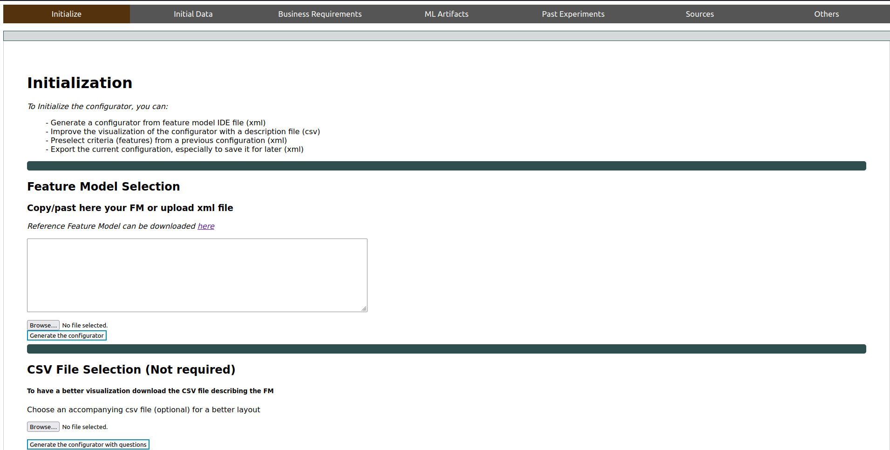
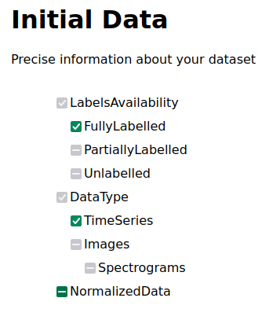
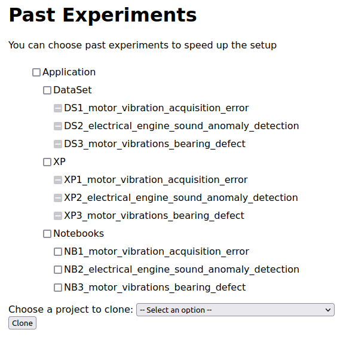
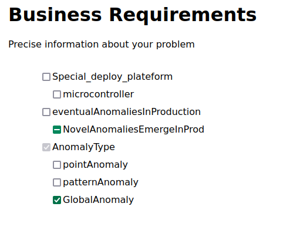
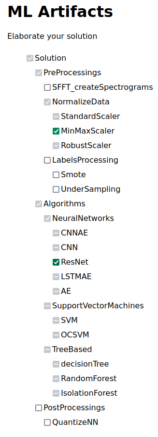

# About

The goal is for you to reproduce the scenario depicted in the _section 5.3_ of the article.

Detailed steps are given to you in order to replicate each step of the scenario.

**Disclaimer** :

We assume from here that you are running the project with Docker as explained in the [README file](https://anonymous.4open.science/r/splc-artifact-files/README.md).

Checkboxes rule :

- One click to check 

- two clicks to disable 

- Three clicks (total) to reset a checkbox

If a checkbox is gray (see image), it has been automatically checked or disabled by the system due to constraint propagation.

- auto check 

- auto disable 

Dataset used in notebooks are **not** given into project zip. This is due to a very limited storage space on the anonymization system. Therefore notebooks **cannot** be executed.

## Protocol

### Run the projet

1. Exec start script -> `./start.sh`

2. Go on this link -> [here](http://localhost:5050/)

You will see this web page:

### Initialize the configurator

3. In the section _Feature Model Selection_, click on _browse_ button.

4. Go through your files, to the project directory. Once you're in, go into _static_, _illustration_test_case_, and select _illustrative_fm_scenario2.xml_.

path: `_path_to_project_dir_/splc-artifact-main/static/illustration_test_case/_illustrative_fm_scenario2.xml`

Once it is done, you should see something like this:

5. Now, click on the button _generate the configurator_.

You are now in the configuration process.

You should now see this on your screen :

**To change**

**Do not worry** about the message saying "this configuration is valid and complete".

The configuration is indeed valid, this means the loading and creation of the whole constraint system is successful.

This area is present across all tabs because it keeps track of all automatically selected or deselected features due to constraint propagation.

### Unfolding the scenario : Elaborate a new notebook and generate

#### Step 1 for scenario 5.3 unfolding

6. Since you are in the tab _Initial Data_, you can check **TimeSeries** and **FullyLabelled** and disable **NormalizedData**.

You should have this result:

> If you click on tab _Appli & Dataset_ you can confirm that all XPs are disabled since none are compatible with the data configuration.

#### Step 2 for scnenario 5.3 unfolding

7. You can now click on tab _Initial Problem_ in order to complete business requirements. Then, you can disable the option **NovelAnomaliesEmergeInProd** and check **GlobalAnomalies**. Since all XPs are not compatible with the configuration, there is no need to clone a notebook.

#### Step 3 for scenario 5.3 unfolding

8. Hence you can go in the tab _Solution_ by clicking on it.

9. You are going to generate two notebooks (to follow the scenario).

For the first one, you are going to check **MinMaxScaler** in _PreProcessings_ and **CNN** for the _Algorithms_.

11. Once it is done, click on the _initialize_ tab.

12. Go down in the page to find the _Export configuration_ section, and then click on _export current configuration_ button. You should see text appear in the text area. It is your complete configuration as xml text.

You should see this on your screen:

13. Then click on the _Generate notebook_ button. If it worked correctly you should see a popup window saying that the notebook has been generated.

14. Finally, click on the _download_ button, and the notebook should be downloaded. Depending on your browser settings, you might be asked where you want to save the file. Save it where it will be easy for you to find it.

15. To generate the second notebook, go back to the _Solution_ tab. You will have to check a **ResNet** as _Algorithms_ instead of a **CNN**. To do that reset the **CNN** checkbox by double clicking it (the goal is to have a blank checkbox). It should also reset all _Algorithms_ options. Once it is done, you can check the **ResNet**.

16. To generate this notebook you can follow steps 11 to 14.

### End

This is the end of this reproduce tutorial. You can open notebooks in order to check their construction but they are not executable as it is specified at the beginning of this document.
